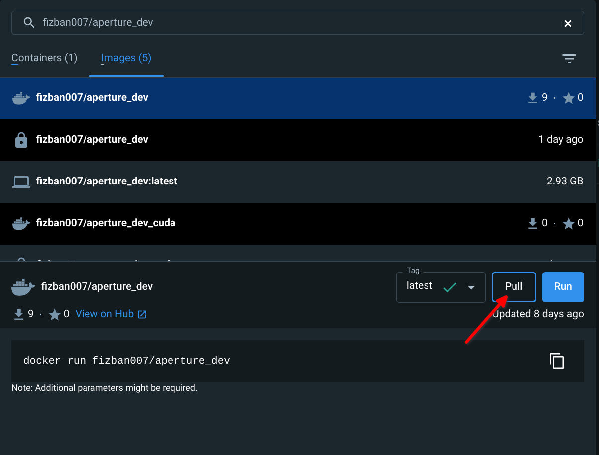
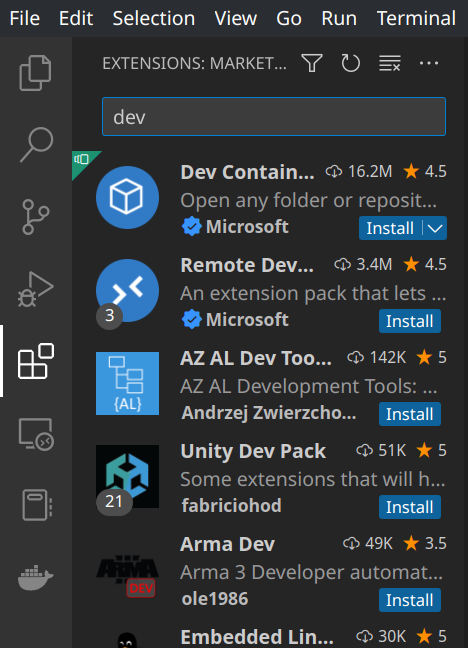
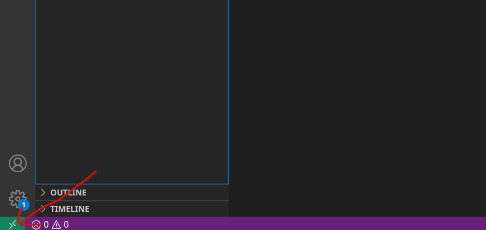
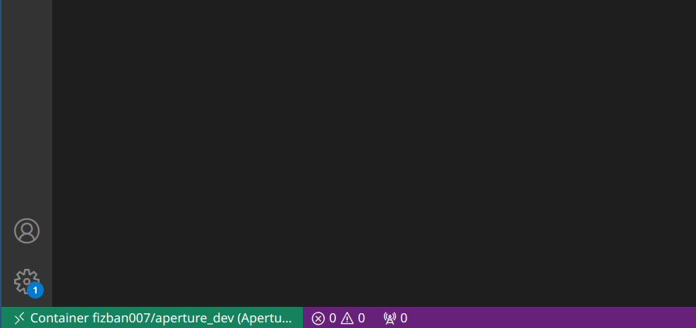
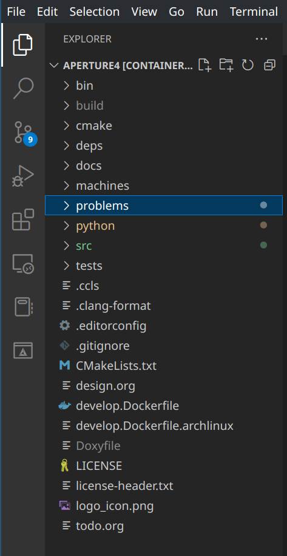

# Tutorial: Two-stream Instability

In this tutorial, we will set up a Docker environment on your laptop for development of the code, and use it to run a basic 1D simulation of the electron two-stream instability.

## Install Docker Desktop

You can download and install Docker Desktop here, regardless of your operating system:
https://www.docker.com/products/docker-desktop/

Run "Docker Desktop". The first time it will try to setup your machine for Docker containers, so expect waiting for several minutes. But eventually you should see the main user interface of Docker Desktop. You can safely skip the initial tutorial.

In order to prepare for our next steps, we want to create a persistent volume to hold all our development files. This can be done by clicking "Volumes" on the left panel, and then "Create" at the top right corner. Name it whatever you want, but I'll use `vol_home` as the volume name for the rest of this tutorial.

## Pull the development Docker image

Click on the "Search" bar on the top right of Docker Desktop. Type in `fizban007/aperture_dev`. You will see my image shown below. You can download the image by clicking "Pull":



Alternatively, you can open a terminal and run the following command

```bash
docker pull fizban007/aperture_dev
```

This will download the Docker image that contains all the development libraries necessary for compiling/debugging `Aperture`. The Docker image is pretty large at about 2.9GB, so the download will probably take a while depending on the speed of your internet connection. After the download is done, you should be able to see it under "Images" in the Docker Desktop.

Now you can create a named container with this image and run it using the following command in a terminal (note: don't add extra spaces or the command may fail):

```bash
$ docker run -it --mount source=vol_home,target=/home/developer --name Aperture_dev fizban007/aperture_dev
```

Note that we referred to the volume we created in the previous step, and mounted it at `/home/developer`. The reason we mount the volume here is that the default user in the Docker image is `developer`, and this is the default home directory. The command above will *create a new container* with the name `Aperture_dev` and put you under a bash shell inside the Docker container. In the Docker Desktop GUI, you should be able to see our new container "Aperture_dev" in the "Containers" tab.

You can checkout our PIC code `Aperture` using the following command inside the container:

```bash
$ cd ~
$ git clone https://github.com/fizban007/Aperture4.git --branch develop
```

This will create a directory called `Aperture4` in your mounted volume (inside the home directory of user `developer`). This will be the directory we work with in the future. Note we cloned the `develop` branch, which is the most up-to-date and actively maintained one.

We only need to create the container for one time. Afterwards, if you want to restart the container, the `docker run` command above will fail because we already have a container named "Aperture_dev". Instead, you can do:

```bash
$ docker start Aperture_dev
$ docker attach
```

This will start the container and put you under a command line prompt.

## Install Visual Studio Code

Download and install VS Code from here: https://code.visualstudio.com/

Run VS Code. You will be directed to a "Get started" page. Click on the 5th icon on the left panel marked "Extensions". We want to install the "Dev Containers" extension to allow us to attach to a running Docker container.



After installing "Dev Containers" (and possibly reloading VS Code), you should be able see a green button at the lower left corner of the window:



Clicking the button, you will be prompted to choose an option to open a remote window. Choose "Attach to a Running Container...", and select "Aperture_dev" (which should be the only option). This will open a new window and the lower left corner should now display "Container fizban007/aperture_dev (Aperture_dev)":



After connecting to the container, select "Open Folder..." and choose `/home/developer/Aperture4`. This should open the project and display all the source files and folders on the left panel:



These are all the source files of `Aperture`, and some associated data analysis scripts.

We will now need to install some development plugins on the container. The most notable ones are `C/C++`, `CMake Tools`, `clang-format`, `Better TOML` and `Jupyter`. This way you can enable code auto-completion on all files inside the container, as well as use the integrated CMake utilities. You can also install `C/C++ Extension Pack` which will install `CMake Tools` automatically.

## Building the Code in VS Code

After installing the extensions, you will see that the bottom bar of VS Code is now modified. It will show "CMake: [Release]: Ready" and "No active kit":


You can click on the "No active kit" button to choose a kit. Choose "GCC 12.2.0" as that is the default compiler in the Docker image. Then click on the "CMake:" button and choose "Release" again. It will prompt VS Code to run cmake again with the correct setup. You should see the output above eventually say "Build files have been written to: /home/developer/Aperture4/build". This means that all build instructions generated by CMake are now in the "Aperture/build" directory. You can proceed to build the code by clicking on "Build", next to the kit selection. In the future, if you have changed some files and would like to recompile the code base, you can click "Build" again.

## Building the Code from Command Line

Alternatively, you can also build the code from command line, without the use of VS Code. Starting inside the container, assuming you just cloned the `Aperture4` repository, you can build the code using the following commands:

```bash
$ cd ~/Aperture4
$ mkdir build
$ cd build
$ cmake ..
$ make -j8
```

The `cmake` command generates the necessary compiler instructions and a `Makefile`, the `make` runs the commands inside that `Makefile` and compiles the entire codebase. The `-j8` option tells `make` to use 8 parallel processes, significantly speeding up the compilation.

## Running Basic Unit Tests

After you have built the code base, you can run the simple unit test suite using the command `make check` in the `build` directory. This will (ideally) perform a series of very basic functionality tests to make sure there is no catastrophic problems in the code base. Since the unit tests only cover very basic things, this is not a guarantee that all components of the code will operate correctly.

You can also do this within VS Code. Click on the "[all]" button next to "Build", which will allow you to choose the compilation target. We want to choose `check`, then clicking on "Build" will effectively allow us to run `make check` in the build directory as if we were doing it in the terminal.

## Running a Simple Simulation Example

I prepared two very basic simulation examples in the code base, under `problems/examples`. All of the different setups in `Aperture` are stored in the `problems` directory, and the compiled binaries go into the `bin` directory of each problem. For example, after you have successfully compiled the code base, you should be able to see two files under `problems/examples/bin/`: `em_wave` and `test_particle`. Run the `test_particle` simulation using the following command:

```bash
$ cd ~/Aperture4/problems/examples/bin
$ ./test_particles
```

This will simulate a bunch of test particles moving in a uniform magnetic field. After the simulation is completed, you can see that there is a new directory called `Data` generated under `examples/bin`. This directory contains the outputs from the simulation. You should see `fld.[00000-01000].h5` which contains the field data for timesteps 0 through 1000, as well as `ptc.[00000-01000].h5` which contains the tracked particle data. `grid.h5` contains information about the grid, and `config.toml` contains the simulation parameters.

## Looking at Simulation Data

Our main way to analyze simulation data is through python in a Jupyter notebook. You can navigate to `python/Examples - Test Particle.ipynb` inside VS Code. It will open up a jupyter notebook interface containing the code blocks. We want to start a jupyter server inside the container and attach to that server in our VS Code window. To do that, open a terminal in VS Code using the short cut `Ctrl + Shift + ` `, or click on the menu "Terminal -> New Terminal".

In the new terminal, navigate to the `python` directory using `cd python`, then run `jupyter server`. It will start a jupyter instance that can run python code in the notebook. You should be able to see something like this:


Copy the url highlighted in the red rectangle. Click on the "Jupyter Server: Remote" button near the lower right, highlighted by the red arrow above. In the menu that pops up, click "Existing". It will should automatically paste the link that you just copied in the prompt. If not, paste it manually. Press enter (twice, the second prompt you can leave blank), jupyter should now be connected to the instance inside the container. You can verify that this is correctly set up by looking at the top right corner of the VS Code window:


If it shows "Python 3 (ipykernel)" like shown in the figure, then you are done. If not, click on it, and choose "Python 3 (ipykernel)" which should also say "(Remote) Jupyter Kernel".

Now you can execute the notebook. It will plot the trajectory of two particles, which should trace out a fat circle in the plane. Feel free to play with the notebook and look at different aspects of the trajectory.

## Simulating Electron Two-Stream Instability

Let us try to use the code to run a simple realization of the electron two-stream instability. `Aperture` contains a setup ready, located in `problems/two_stream`. After you have successfully compiled the code using either [VS Code](#building-the-code-in-vs-code) or [from the command line](#building-the-code-from-command-line), there should be an executable file `two_stream_1d` inside the directory `problems/two_stream/bin`. In general, `Aperture` is organized such that every problem directory under `problems` will have `src` (which contains the source files of that problem setup) and `bin` (which contains the compiled binary files) directories.

We will be using the configuration file `config_1d.toml` which is bundled with the code by default and located under `problems/two_stream/bin`. Review the contents of the file. It defines key numerical parameters such as the physical size of the simulation box, as well as the number of grid cells in each dimension. In particular, `ranks` determines how many MPI ranks are assigned to each dimension. The total number of ranks should map to the number of physical CPU cores used for the simulation. Adjust the number of ranks in `config_1d.toml` to the number of CPU cores available in your Docker container. You can find this number by going to the Docker Desktop configuration:


then click on "Resources". It will show how many cores on your machine are allocated to the container. For the purpose of this tutorial I will assume this number is 8.

You can launch the two-stream simulation in the command line using:

```
mpirun -np 8 ./two_stream_1d -c config_1d.toml
```

We use `mpirun` because it sets up the MPI environment with the correct number of CPUs. `-np 8` tells `mpirun` to use 8 physical cores, which you need to change to the number of ranks you assigned in the configuration file. `./two_stream_1d` is the name of the executable, and the option `-c config_1d.toml` specifies that we will be using `config_1d.toml` as our configuration file. If we do not specify this option, `Aperture` defaults to use the file named `config.toml`. If no such a file is in the current directory, all configuration options will be taken as default (which may very likely not make sense for your application).

Depending on the speed of your development machine, the simulation will take anywhere from 30 seconds to several minutes. After it is done, you can see a directory `Data` created in `problems/two_stream/bin`. This is the directory that contains simulation outputs and the one we will analyze.

## Analyzing Two-Stream Data

Start a Jupyter server using the instructions [above](#looking-at-simulation-data). Open the note book `python/Two Stream Test.ipynb`. You should be able to run the entire notebook. The first cell loads the necessary libraries. The second cell loads the two stream data that we produced in the previous step. The third cell plots a single snapshot of the phase space of electrons. The 4th cell creates such a plot for every output time steps. The plots are located under `python/plots`. You can look at the plots in VS Code as well. Finally the 5th cell computes the energy history of the electric field, and the 6th cell plots it.

In order to make a movie with the plots, you can open a terminal in VS Code and run:

```
cd python
ffmpeg -y -f image2 -r 14 -i plots/%05d.png -c:v h264 -crf 18 -vf "pad=ceil(iw/2)*2:ceil(ih/2)*2" -pix_fmt yuv420p phase_space.mp4
```

If you do not have `ffmpeg` in the Docker container, remember to pull the latest image from Docker Hub and re-create your container using the instructions [above](#pull-the-development-docker-image).

Once you successfully produced `phase_space.mp4`, you can look at it in VS Code. You can also download it to your local machine by right clicking on the file and choose "Download".

